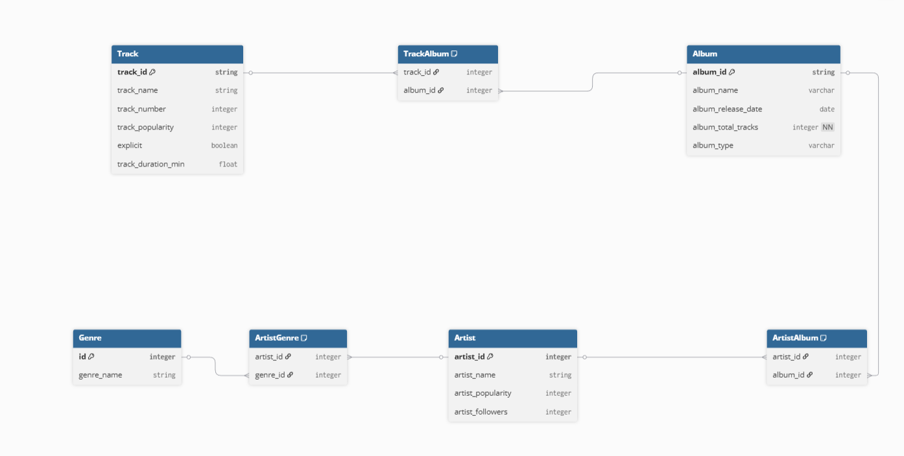

Le but du projet est de créer une API qui fera du crud sur une base de données. On utilisera ici une base de données Spotify sur PostGreSQL.

### Données Spotify 2025

Ce fichier contient des informations sur des morceaux récents et contemporains disponibles sur Spotify, principalement issus de l’année 2025.

Chaque ligne du fichier représente un morceau unique avec les attributs suivants par exemple:

- **Titre du morceau**
- **Artiste**
- **Album**
- **Popularité**

Voici le modèle de la base de données :

Un artiste peut avoir un ou plusieurs albums et appartenir à plusieurs genres.
Un titre peut appartenir à plusieurs albums et un album peut avoir plusieurs titres.


La base de données est structurée autour des éléments suivants :
- track : correspond à une piste musicale
- artist : représente un artiste
- album : représente un album
- genre : liste des catégories musicales

tables relationnelles :
- track_album relie une piste à un album
- artist_album relie un artiste à un album
- artist_genre relie un artiste à un genre

Une table supplémentaire log_track_updates permet de suivre automatiquement les opérations effectuées sur les pistes.

Ce projet propose une API construite avec FastAPI permettant de gérer des données inspirées de l’univers Spotify. Elle se connecte à une base PostgreSQL et expose plusieurs routes pour administrer pistes, artistes, albums, genres ainsi que l’historique des modifications.
Le système repose également sur des fonctions PL pgSQL, des triggers et une structure relationnelle SQL complète.

### Lancement du projet

Le projet est lancé avec Docker compose. On a une image pour la base de donnée spotify_db et une image pour l'api. Il suffit de lancer la commande


```bash
docker compose up --build
```

Ensuite on pourra accéder à l'api sur 

```bash
http://localhost:8000/docs
```
La base de donnée sera alimenté à l'aide du fichier full_init.sql dans le dossier sql. Il est possible de consulter les schémas, fonctions et triggers dans les fichiers functions.sql, schemas.sql et trigger.sql


### Fonctions

Les fonctions seront utilisées pour la table track 

- get_track_by_id : récupère une piste selon son identifiant
- search_track : recherche une piste selon un mot clé
- add_track : insère une nouvelle piste
- update_track_data : met à jour une piste tout en conservant les informations non modifiées
- delete_track_data : supprime une piste et retourne si l’opération a réussi

### Triggers
Deux triggers sont positionnés sur la table track :
- un après insertion
- un après modification
À chaque opération, une entrée est insérée dans log_track_updates avec :

- l’identifiant du track
- l’action réalisée (INSERT ou UPDATE)
- la date de modification automatique
